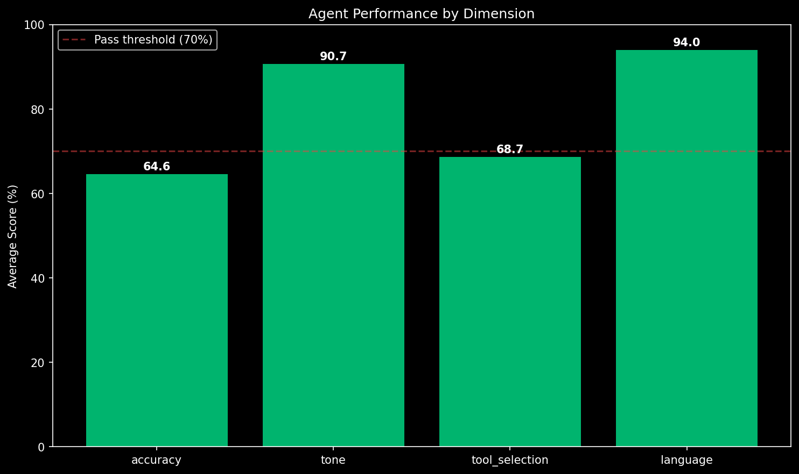
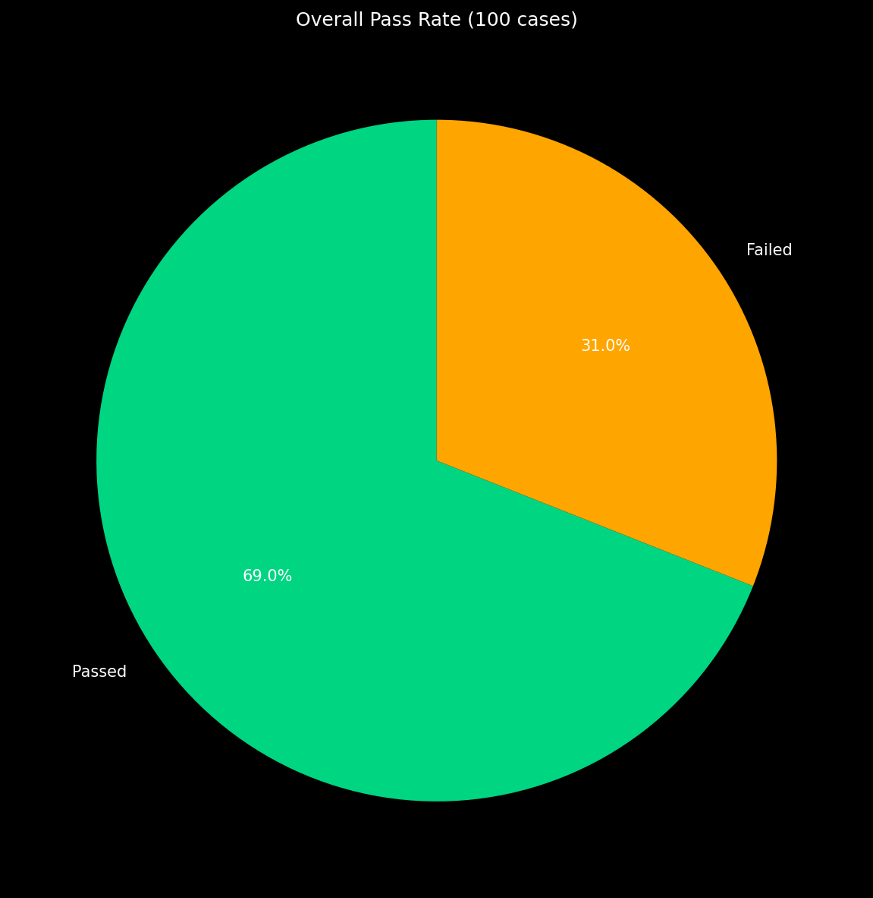
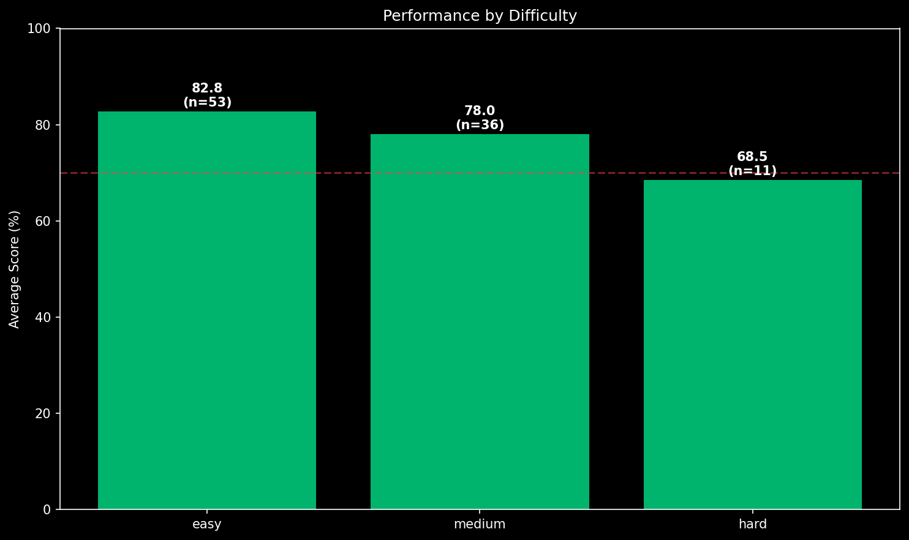

# Javva Evaluation Report

Generated: 2026-05-09T09:08:51.861525+00:00
Total cases: 100
Duration: 11m 9s
Estimated cost: ~$0.060 USD

## Summary

- **Pass rate**: 69.0% (69/100)
- **Errors**: 0
- **Failed cases**: 31

## Average Scores by Dimension

| Dimension | Score |
|-----------|-------|
| Accuracy | 64.6% |
| Tone | 90.7% |
| Tool Selection | 68.7% |
| Language | 94.0% |

## Pass/Fail Distribution

## Performance by Difficulty

- **EASY**: 82.8% avg (53 cases)
- **MEDIUM**: 78.0% avg (36 cases)
- **HARD**: 68.5% avg (11 cases)

## Performance by Language

- **EN**: 83.0% avg (52 cases)
- **ID**: 75.7% avg (48 cases)

## Performance by Intent

- **faq**: 90.5% avg (53 cases)
- **escalate**: 68.9% avg (18 cases)
- **account_query**: 66.0% avg (29 cases)

## Failure Examples (lowest 5)

### 1. Case `eval-090` — Score: 0.0%

**User**: My account number is ACC123456. Can you check the status for me?
**Expected tools**: ['check_kyc_status']
**Agent tools called**: []
**Agent reply**: Maaf, format nomor akun yang Anda berikan (ACC123456) tidak benar. Mohon berikan nomor akun Anda dalam format USR diikuti dengan 6 digit angka (contoh: USR000123).

**Judge breakdown**:
- Accuracy: 0 (The agent completely failed to answer the user's question. Instead of checking the account status, it incorrectly claimed the account number format was wrong an)
- Tone: 0
- Tool Selection: 0
- Language: 0

**Judge summary**: Overall, this is a catastrophic failure. The agent responded in the wrong language, failed to use any tools, did not answer the user's question, and provided incorrect, unhelpful information. The resp

---

### 2. Case `eval-058` — Score: 5.0%

**User**: My KYC was rejected. Can you tell me why and what I should do next?
**Expected tools**: ['check_kyc_status', 'search_faq']
**Agent tools called**: []
**Agent reply**: Untuk memeriksa alasan penolakan dan langkah selanjutnya, saya memerlukan ID pengguna Anda. ID pengguna Anda harus dalam format USR diikuti oleh 6 digit (misalnya, USR000123).

**Judge breakdown**:
- Accuracy: 20 (The agent did not answer the user's question about why their KYC might have been rejected or what the general next steps are. Instead, it only asked for a user )
- Tone: 0
- Tool Selection: 0
- Language: 0

**Judge summary**: Overall: The agent's response was a complete failure. It responded in the wrong language, used the wrong tone, failed to call any necessary tools, and did not answer the user's question. It only asked

---

### 3. Case `eval-081` — Score: 5.0%

**User**: Saya mengalami kerugian besar karena slippage yang parah. Ini tidak pernah terjadi sebelumnya. Apa yang bisa dilakukan?
**Expected tools**: ['lookup_account', 'list_transactions']
**Agent tools called**: ['escalate_to_human_tool']
**Agent reply**: I've escalated your case to our human support team. Your ticket number is TKT-8E463ECB. A specialist will respond within 24 hours via email.

**Judge breakdown**:
- Accuracy: 0 (The agent completely failed to address the user's question. The expected behavior was to gather information about the user's account and transactions to investi)
- Tone: 0
- Tool Selection: 20
- Language: 0

**Judge summary**: The agent's response was a complete failure. It responded in the wrong language, used the wrong tool, adopted an inappropriate tone, and did not answer the user's question, instead taking an action th

---

### 4. Case `eval-071` — Score: 17.5%

**User**: Saya lupa password untuk akun trading saya. Bisakah Anda membantu saya meresetnya?
**Expected tools**: ['search_faq']
**Agent tools called**: ['escalate_to_human_tool']
**Agent reply**: I apologize, but I cannot directly assist with password resets as it requires human verification for security purposes. I have escalated your request to our support team, and a specialist will contact you via email within 24 hours to help you reset your password. Your ticket number is TKT-4C4F17B5.

**Judge breakdown**:
- Accuracy: 0 (The agent failed to answer the user's question. Instead of providing the simple steps to reset a password as expected, it incorrectly escalated the issue to a h)
- Tone: 50
- Tool Selection: 20
- Language: 0

**Judge summary**: Overall, the agent's response was very poor. It failed to answer a simple question, used the wrong tool, responded in the wrong language, and unnecessarily escalated the conversation. It did not meet 

---

### 5. Case `eval-098` — Score: 25.0%

**User**: Nomor akun saya adalah 987654 dan saya mengajukan penarikan sebesar $1000 kemarin. Kapan dana itu akan masuk?
**Expected tools**: ['lookup_account', 'list_transactions']
**Agent tools called**: ['list_transactions']
**Agent reply**: I encountered an issue trying to retrieve your transaction information. Please try again in a moment.

**Judge breakdown**:
- Accuracy: 0 (The agent did not answer the user's question. Instead of providing information about the withdrawal, it returned a generic error message stating it couldn't ret)
- Tone: 50
- Tool Selection: 50
- Language: 0

**Judge summary**: Overall, the agent's response is a complete failure. It responded in the wrong language, used incomplete tools, and did not answer the user's question, instead providing a generic error message.

---

## Methodology

- **Agent**: gemini-2.5-flash-lite via Vertex AI
- **Judge**: gemini-2.5-pro via Vertex AI (different tier to reduce same-provider bias)
- **Eval set**: 100 cases from `data/eval_cases.json` (Phase A.3)
- **Concurrency**: 3 parallel cases (Vertex rate-limit safe)
- **Pass threshold**: overall score ≥ 70%
- **Scoring**: 4 dimensions (accuracy, tone, tool_selection, language), 0-100 each

## Caveats

- Same-provider risk: agent and judge both come from the Gemini family. The
  tier gap (Pro vs Flash-Lite) reduces but does not eliminate this; an
  external judge (e.g. GPT-4o) is recommended before any production claim.
- Cost figure is an order-of-magnitude estimate, not actual billing.

---

*Generated by Javva Phase H eval pipeline.*
